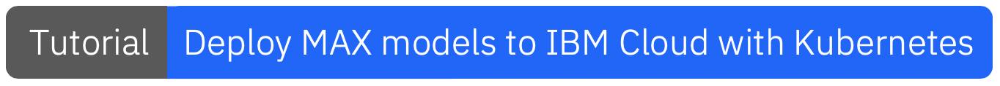
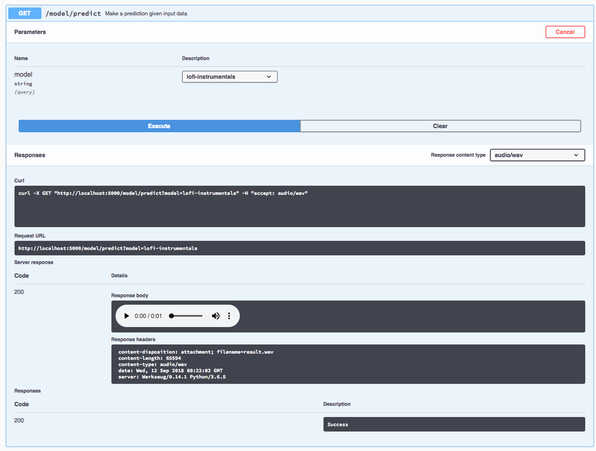

[](https://travis-ci.com/IBM/MAX-Audio-Sample-Generator)
[](http://max-audio-sample-generator.codait-prod-41208c73af8fca213512856c7a09db52-0000.us-east.containers.appdomain.cloud)

[](http://ibm.biz/max-to-ibm-cloud-tutorial)

# IBM Developer Model Asset Exchange: Audio Sample Generator

This repository contains code to instantiate and deploy an audio generation model. The model generates short samples
based on an existing dataset of audio clips. It maps the sample space of the input data and generates audio clips that
are "inbetween" or "combinations" of the dominant features of the sounds. The model architecture is a generative
adversarial neural network, trained by the [IBM CODAIT Team](http://codait.org) on lo-fi instrumental music tracks from the
[Free Music Archive](http://freemusicarchive.org) and short spoken commands from the
[Speech Commands Dataset](https://ai.googleblog.com/2017/08/launching-speech-commands-dataset.html). The model can
generate 1.5 second audio samples of the words `up`, `down`, `left`, `right`, `stop`, `go`, as well as lo-fi
instrumental music.

The model is based on the [WaveGAN Model](https://github.com/chrisdonahue/wavegan). The model files are hosted on
[IBM Cloud Object Storage](https://max-cdn.cdn.appdomain.cloud/max-audio-sample-generator/1.0.0/assets.tar.gz).
The code in this repository deploys the model as a web service in a Docker container. This repository was developed as
part of the [IBM Code Model Asset Exchange](https://developer.ibm.com/code/exchanges/models/) and the public API is powered by [IBM Cloud](https://ibm.biz/Bdz2XM)..

## Model Metadata
| Domain | Application | Industry  | Framework | Training Data | Input Data Format |
| ------------- | --------  | -------- | --------- | --------- | -------------- | 
| Audio | Audio Modeling | General | TensorFlow | [Speech Commands](https://www.kaggle.com/c/tensorflow-speech-recognition-challenge/data) & [FMA tracks](http://freemusicarchive.org/search/?adv=1&quicksearch=uncle+milk&search-genre=Genres&duration_from=&duration_to=) | None | 

## References

* _Chris Donahue, Julian McAuley, Miller Puckette_, ["Synthesizing Audio with Generative Adversarial Networks"](https://arxiv.org/abs/1802.04208), arXiv, 2018.
* [WaveGAN Github repository](https://github.com/chrisdonahue/wavegan)
* [Speech Commands Dataset release blog](https://ai.googleblog.com/2017/08/launching-speech-commands-dataset.html)
* [Free Music Archive](http://freemusicarchive.org/about)

## Licenses

| Component | License | Link  |
| ------------- | --------  | -------- |
| This repository | [Apache 2.0](https://www.apache.org/licenses/LICENSE-2.0) | [LICENSE](LICENSE) |
| Model Weights | [Apache 2.0](https://www.apache.org/licenses/LICENSE-2.0) | [LICENSE](LICENSE) |
| Model Code (3rd party) | [MIT](https://opensource.org/licenses/MIT) | [LICENSE](https://github.com/chrisdonahue/wavegan/blob/master/LICENSE.txt) |

## Pre-requisites:

* `docker`: The [Docker](https://www.docker.com/) command-line interface. Follow the [installation instructions](https://docs.docker.com/install/) for your system.
* The minimum recommended resources for this model is 2GB Memory and 1 CPUs.
* If you are on x86-64/AMD64, your CPU must support [AVX](https://en.wikipedia.org/wiki/Advanced_Vector_Extensions) at the minimum.

# Deployment options

* [Deploy from Quay](#deploy-from-quay)
* [Deploy on Red Hat OpenShift](#deploy-on-red-hat-openshift)
* [Deploy on Kubernetes](#deploy-on-kubernetes)
* [Run Locally](#run-locally)

## Deploy from Quay

To run the docker image, which automatically starts the model serving API, run:

```bash
$ docker run -it -p 5000:5000 quay.io/codait/max-audio-sample-generator
```

This will pull a pre-built image from the Quay.io container registry (or use an existing image if already cached locally) and run it. If
you'd rather checkout and build the model locally you can follow the [run locally](#run-locally) steps below.

## Deploy on Red Hat OpenShift

You can deploy the model-serving microservice on Red Hat OpenShift by following the instructions for the OpenShift web console or the OpenShift Container Platform CLI [in this tutorial](https://developer.ibm.com/tutorials/deploy-a-model-asset-exchange-microservice-on-red-hat-openshift/), specifying `quay.io/codait/max-audio-sample-generator` as the image name.

## Deploy on Kubernetes

You can also deploy the model on Kubernetes using the latest docker image on Quay.

On your Kubernetes cluster, run the following commands:

```bash
$ kubectl apply -f https://github.com/IBM/MAX-Audio-Sample-Generator/raw/master/max-audio-sample-generator.yaml
```

The model will be available internally at port `5000`, but can also be accessed externally through the `NodePort`.

A more elaborate tutorial on how to deploy this MAX model to production on [IBM Cloud](https://ibm.biz/Bdz2XM) can be found [here](http://ibm.biz/max-to-ibm-cloud-tutorial).

## Run Locally

1. [Build the Model](#1-build-the-model)
2. [Deploy the Model](#2-deploy-the-model)
3. [Use the Model](#3-use-the-model)
4. [Development](#4-development)
5. [Clean Up](#5-cleanup)

### 1. Build the Model

Clone this repository locally. In a terminal, run the following command:

```bash
$ git clone https://github.com/IBM/MAX-Audio-Sample-Generator.git
```

Change directory into the repository base folder:

```bash
$ cd MAX-Audio-Sample-Generator
```

To build the docker image locally, run: 

```bash
$ docker build -t max-audio-sample-generator .
```

All required model assets will be downloaded during the build process. _Note_ the model files for all audio types are
extremely large and the download will take a while. _Note_ that currently this docker image is CPU only (we will add
support for GPU images later).

### 2. Deploy the Model

To run the docker image, which automatically starts the model serving API, run:

```bash
$ docker run -it -p 5000:5000 max-audio-sample-generator
```

### 3. Use the Model

The API server automatically generates an interactive Swagger documentation page. Go to `http://localhost:5000` to load
it. From there you can explore the API and also create test requests.
Use the `model/predict` endpoint to generate an audio clip from one of the provided models, which can then be played in
the Swagger UI.



You can also test it on the command line. The `model/predict` endpoint returns a bytestream of the audio, which you can
then direct into a file using `>`; for example:

```bash
 $ curl -X GET 'http://localhost:5000/model/predict' -H 'accept: audio/wav' > result.wav
```

This will save the generated `wav` file in the current directory.

You can generate samples for different classes of audio by setting the `model` request parameter to one of: `up`, `down`, `left`, `right`, `stop`, `go` or `lofi-instrumentals` (the default). For example to generate a sample of the word `stop`:

```bash
$ curl -X GET 'http://localhost:5000/model/predict?model=stop' -H 'accept: audio/wav' > stop.wav
```

### 4. Development

To run the Flask API app in debug mode, edit `config.py` to set `DEBUG = True` under the application settings. You will
then need to rebuild the docker image (see [step 1](#1-build-the-model)).

### 5. Cleanup

To stop the Docker container, type `CTRL` + `C` in your terminal.

## Resources and Contributions
   
If you are interested in contributing to the Model Asset Exchange project or have any queries, please follow the instructions [here](https://github.com/CODAIT/max-central-repo).
